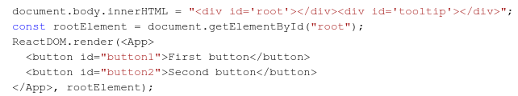
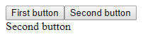

# Question 1

Finish The Tootip component using React portals. Clicking any button on the page should display the buttons's text content inside the Tooltip component. The Tooltip component should render inside the element with the tooltip id.

For example, if App component is rendered like 

And button with id button2 is clickes, div with id tooltip should container "Second Button".

After the button click, the page should look like:

